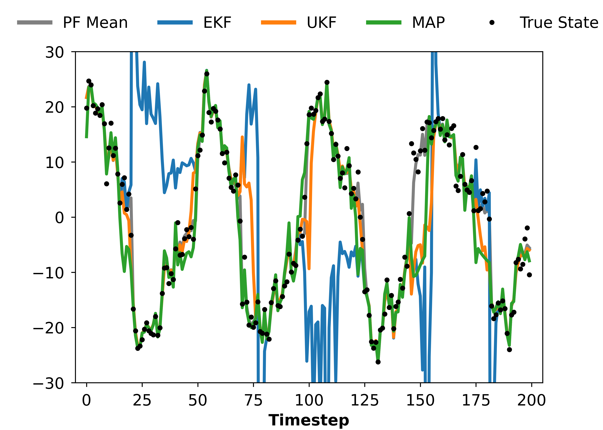
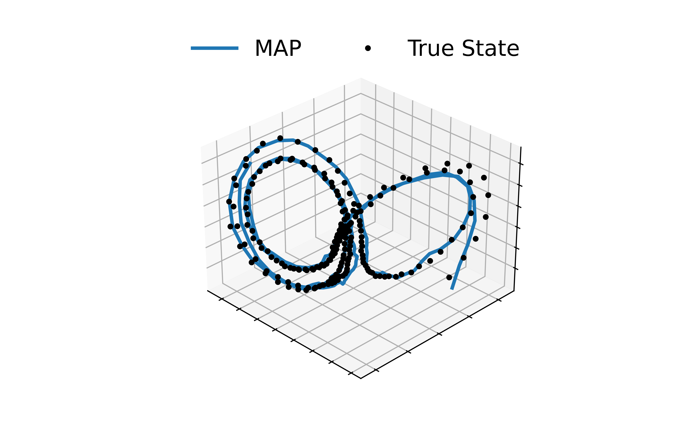

Code to accompany "Implicit Maximum a Posteriori Filtering via Adaptive Optimization" by Gianluca Bencomo, Jake Snell, and Tom Griffiths (under review at ICLR 2023). We demonstrate how the stochastic filtering problem, typically solved explicitly via a Bayesian filter, can be solved implicitly via specifying an optimizer (see Figure below for intuition). All results and figures in our paper can be reproduced using this repository.


# Dependencies

The following dependencies are required:
```
flax==0.6.4
jax==0.4.1
matplotlib==3.6.3
numpy==1.24.3
optax==0.1.4
Pillow==10.0.1
scikit_learn==1.2.1
scipy==1.11.3
torchvision==0.15.2
typer==0.9.0
```
Other versions of the above packages may work but have not been tested.

# Downloading Data

The yearbook dataset (https://people.eecs.berkeley.edu/~shiry/projects/yearbooks/yearbooks.html) download is required. Please download, unzip, and rename the resulting directory `data` and move it to `./yearbook`.

# Toy Nonlinear System and Stochastic Lorenz Attractor

The toy nonlinear system and stochastic Lorenz attractor results can be reproduced via the code in `./nonlinear`. `experiment.py` runs the experiments reported in the paper. `main.py` can be used to visualize the two systems and their associated filter estimates.

For example, the following code will runs the toy nonlinear system with the Adam optimizer: 
```
python nonlinear/main.py --system nonlinear --optimizer Adam --plot --verbose
```
This produces the following figure:



Similarly, we can run the stochastic Lorenz attractor with the following:
```
python nonlinear/main.py --system lorenz --optimizer Adam --plot --verbose
```
This produces the following figure:



`main.py` is highly customizable, where we can visualize any of the systems in `data.py`, test any of the filters in `filter.py`, and use any of the optimizers in `optimizers.py`.

# Yearbook Dataset

To run implcit Maximum a Posteriori filtering with the yearbook dataset, we can use the following command:

```
python main.py --steps 50 --model map --verbose
```
The Adam optimizer is the default optimization method, and we only specify the number of steps to optimize with.